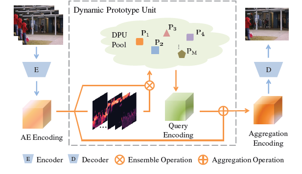
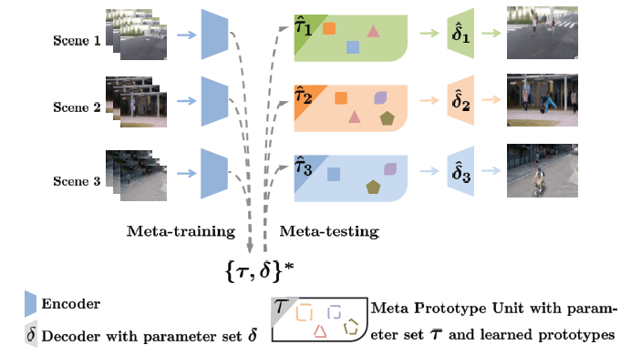
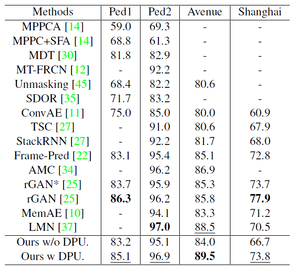
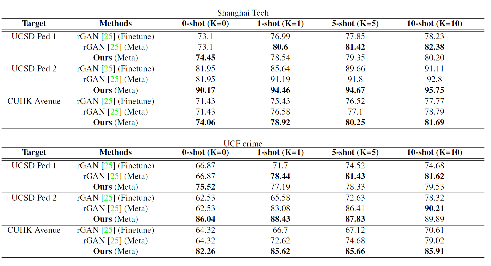

# Codes_MPN
Official codes of CVPR21 paper: Learning Normal Dynamics in Videos with Meta Prototype Network (https://arxiv.org/abs/2104.06689)

# MPN Framework



# Paper Results on Unsupervised VAD

# Paper Results on Few-shot VAD



# Preparation 
Please download the corresponding benchmarks in 'data' directory. Then prepare the environment as in requirement.txt.


# Unsupervised Anomaly Detection Model Training
Run 'python Train.py' to train a model with DPU model.

# Meta-learning Anomaly Detection Model Training
Run 'python Train_meta.py' to train a model with MPU model.

# Meta-learning Anomaly Detection Model Testing
Run 'python Test_meta.py' to train a model with MPU model.

If you find this work helpful, please cite:
```
@inproceedings{Lv2021MPN,
  author    = {Hui LV and
	       Chen Chen and
               Zhen Cui and
               Chunyan Xu and
               Yong Li and
               Jian Yang},
  title     = {Learning Normal Dynamics in Videos with Meta Prototype Network},
  booktitle = {The IEEE Conference on Computer Vision and Pattern Recognition (CVPR)},
  year      = {2021}
}
```
